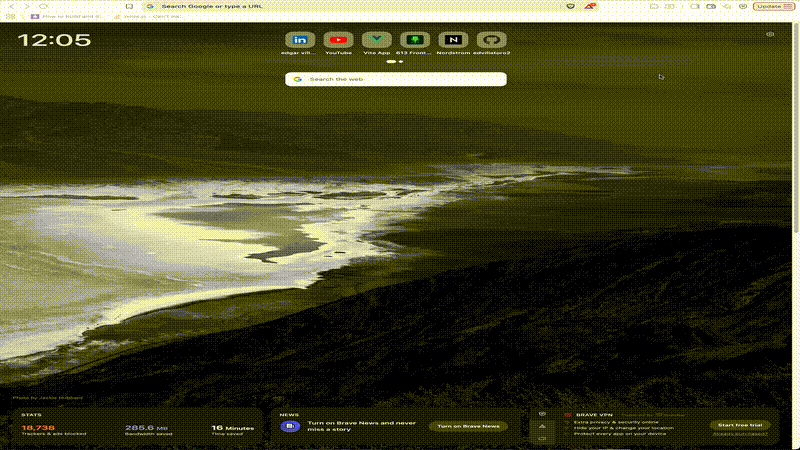

# Fetch - YouTube Video Organizer

A Chrome extension that helps you organize and sort your YouTube subscriptions.

## 📸 Demo



## 🚀 Features

- OAuth integration with YouTube API
- Sort videos by date, channel, etc.
- Side panel interface
- Built with Vue 3 `<script setup>` syntax
- Full TypeScript support

## 🛠️ Tech Stack

- **Vue 3** - Composition API with `<script setup>`
- **TypeScript** - Full type safety
- **Vite** - Lightning-fast build tool
- **CRXJS** - Vite plugin for Chrome extensions
- **Tailwind CSS v4** - Modern styling
- **Chrome Extension Manifest V3** - Latest extension platform

## 📦 Quick Start

1. **Clone this repo**
   ```bash
   git clone https://github.com/edvillatoro2/fetch
   cd fetch
   ```

2. **Install dependencies**
   ```bash
   npm install
   ```

3. **Start development server**
   ```bash
   npm run dev
   ```

4. **Load the extension in Chrome**
   - Navigate to `chrome://extensions/`
   - Enable **Developer mode** (top right)
   - Click **Load unpacked**
   - Select the `dist/` folder

The CRXJS plugin provides hot-reload during development - changes appear instantly without manually reloading the extension!

## 🏗️ Build for Production

```bash
npm run build
```

The production-ready extension will be in the `dist/` folder.

## 📁 Project Structure

```
src/
├── popup/          # Extension popup UI
├── sidepanel/      # Side panel interface
├── content/        # Content scripts (runs on YouTube pages)
├── background/     # Background service worker
└── components/     # Shared Vue components
manifest.config.ts  # Chrome extension manifest configuration
```

## 🔧 Chrome Extension Development Notes

- **Manifest configuration**: Use `manifest.config.ts` to configure your extension
- **Auto-generated manifest**: CRXJS automatically handles manifest generation
- **Content scripts**: Place in `src/content/` - these run on web pages
- **Popup UI**: Place in `src/popup/` - shown when clicking extension icon
- **Side panel**: Place in `src/sidepanel/` - persistent side panel in browser

## 📚 Documentation

- [Vue 3 Documentation](https://vuejs.org/)
- [Vite Documentation](https://vitejs.dev/)
- [CRXJS Documentation](https://crxjs.dev/vite-plugin)
- [Chrome Extensions Documentation](https://developer.chrome.com/docs/extensions/)

## 🔗 Status

Currently under review for Chrome Web Store publication.
